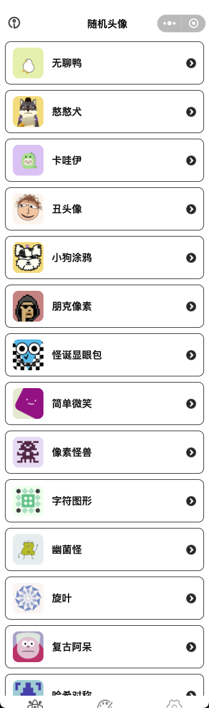

# 潦草头像馆：让你的头像不再 “撞衫”
潦草头像馆支持随机生成多种风格的头像图片，让你的头像不再“撞衫”。

stray_avatar是潦草头像的开源代码项目，包括两个部分：  
1. 微信小程序端（avatar_generator）  
2. 服务端（avatar_generator_server）

**技术栈：**  
uniapp开发实现的微信小程序  
spring-boot实现的服务端（svg转png）  

**功能体验**  

## 功能介绍

还在为找一张独特的头像翻遍全网？还在担心社交平台上和别人 “撞头像” 的尴尬？现在，有一款微信小程序能帮你轻松解决这些烦恼，更能让你和心爱的 TA 一起创造专属回忆！别再让头像成为你的困扰，无论是想快速拥有独特图像，还是亲手创造专属回忆，这款小程序都能满足你！现在就去微信搜索体验，让你的头像与众不同，让每一份创意都被看见！更贴心的是，所有生成的图片都支持一键导出，省心又方便！  

### 随机头像
随机生成图片功能，六大风格任你挑：  
1. 无聊鸭：帮你生成画风简洁的小鸭子图片，软萌模样瞬间驱散坏心情  
2. 丑头像：随机产出的卡通人物，每一张都自带搞笑基因，个性十足不撞款  
3. 朋克像素：打造的像素朋克风头像，让你在朋友圈里自带高光  
4. 简单微笑：简约纯粹，用最干净的线条传递好心情  
5. 哈希对称：生成的像素对称图，每一次随机都是一场视觉惊喜  
6. 字符图像：根据您输入的字符串，生成一张简单的独一无二的图形
7. 复古阿呆：随机生成复古风格的简单卡通人物图像
8. 怪诞显眼包：随机生成荒诞怪异的卡通表情
9. 像素怪兽：随机生成仿似怪兽的像素表情
10. 幽菌怪：随机生成形态各异的卡通细菌表情
11. 旋叶：根据您输入的字符串，生成一张由旋转叶片勾勒出的图形
12. 卡哇伊：随机生成可爱的卡哇伊风格表情，可自定义颜色
13. 憨憨犬：随机生成形态各异的憨态柴犬，支持对细节进行调整
14. 萌眼小团：萌萌的大眼睛和灵动的小生物
15. 小狗涂鸦：涂鸦风格的小狗头像
   

### 像素画家
如果你想拥有完全独一无二的专属头像，那第二大功能像素画家绝对能满足你！“自己画” 模式让你化身像素艺术家，随心勾勒专属图案，每一笔都是独特心意；而 “一起画” 模式更是情侣专属福利 —— 两台手机通过蓝牙配对，就能共同操控同一个像素画板，你画一笔我补一色，在协作中碰撞出爱的火花，绘制出只属于你们的甜蜜纪念。  

**自己画**  
支持像素画板绘制，支持以下操作：  
1. 滑动或点击进行绘制
2. 颜色选择
3. 擦出操作
4. 像素点移动
5. 颜色填充、替换
6. 画板旋转
7. 清空画板  
   
  

**一起画** 
一起画通过蓝牙连接支持两台手机同时操作同一个画板绘制保存图片。  
[一起画操作视频](./assets/draw_double.mp4)

别再让头像成为你的困扰，无论是想快速拥有独特图像，还是亲手创造专属回忆，这款小程序都能满足你！现在就去微信搜索体验，让你的头像与众不同，让每一份创意都被看见！  

## 开源声明
**【致谢声明】**  
 站在巨人的肩膀上，感恩开源。本小程序中使用或借鉴了下方列出的开源项目里的功能，在此，向所有开发者致以诚挚的感谢。  
1. [唐煊《 ugly-avatar 》](https://github.com/txstc55/ugly-avatar)：“丑头像”随机生成图片的方法基于该项目
2. [唐煊《 duck-duck-duck 》](https://github.com/txstc55/duck-duck-duck)：“无聊鸭”随机生成图片的方法基于该项目
3. [sweeterio《 pixelpunks 》](https://github.com/sweeterio/pixelpunks)：“朋克像素”里使用的资源参考了该项目
4. [boringdesigners《 boring-avatars 》](https://github.com/boringdesigners/boring-avatars)：“简单微笑”里的方法参考了该项目
5. [dmester《 jdenticon 》](https://github.com/dmester/jdenticon)：“字符图形”生成图片的方法基于该项目
6. [copperdong《 faceGenerator 》](https://github.com/copperdong/faceGenerator)：“复古阿呆”生成图片的方法基于该项目
7. [mugendi《 facitars 》](https://github.com/mugendi/facitars):“怪诞显眼包”生成图片的方法基于该项目
8. [KevinGaudin 《 monsterid.js 》](https://github.com/KevinGaudin/monsterid.js):“像素怪兽”的方法基于该项目  
......

完整清单请查看设置页面。

**【开源声明】**  
潦草头像馆小程序遵循 MIT 开源协议。

## 个人小程序作品展示
欢迎扫码体验：  
1. 潦草头像馆：搞怪卡通头像生成工具  

2. 客群采集：基于地理位置的商户信息采集工具    

## ☕️ 赏杯咖啡吧～

